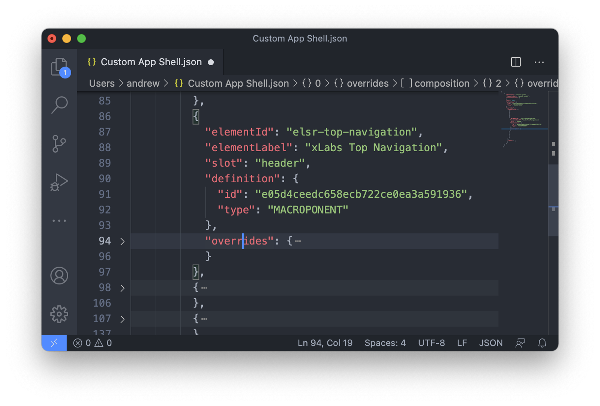
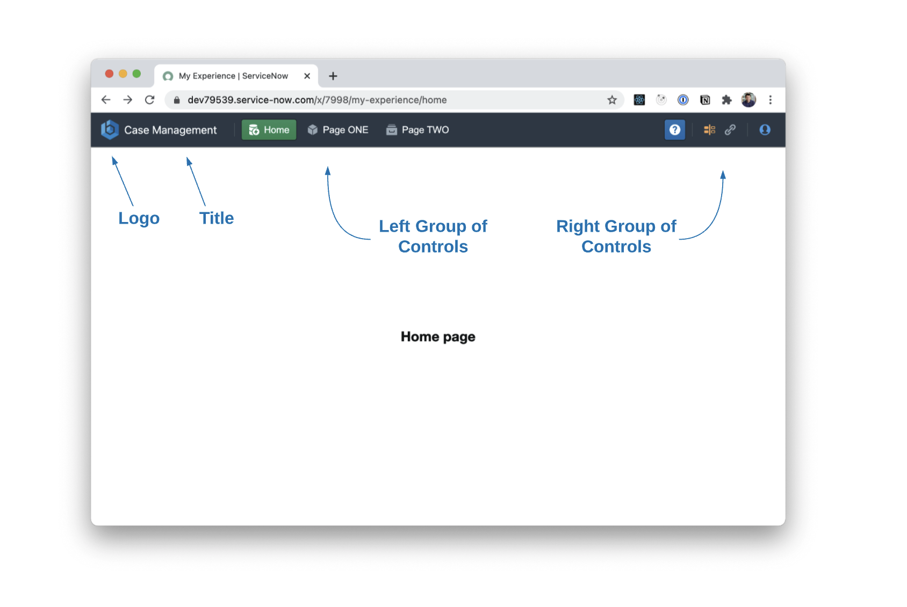

# xLabs Navigation Component

xLabs Navigation Component is a custom ServiceNow UX component.

The component is intended to be used in App Shells to provide custom navigation/routing for Experience apps.

## 1. Installation

Download and install this update set in your ServiceNow instance.

The update set contains the component itself and an example of a custom App Shell which already has a reference to the component.

## 2. Use the component in App Shells


Component sys_id is `e05d4ceedc658ecb722ce0ea3a591936`, so just add it to your App Shell:



## 3. Configuration

The component should be configured properly - your ServiceNow Experience app has to have a UX property with a name `xlabs-navigation` and JSON type value.

In that JSON objec you define a component configuraiton.

The basic structure of the configuration file is simle:

```json
{
    "logo":"/my-logo.png",
    "title":"",
    "leftGroup":[],
    "rightGroup":[]
}
```
* **logo** - that's a path to a logo image. The image should be stored in ServiceNow instance in *System UI -> Images*. If no path provided then a default logo will be displayed.
* **title** - Text to display right to the logo.
* **leftGroup** - that is a left group of controls, it is sticked to the left side of the screen.
* **rightGroup** - group of controls that will be placed on the right of the screen.

You can put as many controls in left/right groups as you want. And you can combine those controls in any way.



### Controls

There are three types of UX controls: divider, button, and anchor-button. Basic syntax for a control configuration:
```json
{
    "type":"button",
    ...
}
```

#### Divider
Divider is a simple separator (vertical line) to separate content of the navigation header, there is no configuration options for a divider contorl:
```json
{
    "type":"divider"
}
```
#### Button
Button is a common button that loads a particular route/page:
```json
 {
    "type":"button",
    "large":false,
    "minimal":false,
    "icon":"data-connection",
    "intent":"success",
    "label":"Home",
    "route":"home"
}
```
Configuration options:
* **large** - defines if the buttons is large or regular one.
* **minimal** - defines the appearance of the button.
* **icon** - the icon to add to the button. You can check all possible icons [here](https://blueprintjs.com/docs/#icons).
* **intent** - can be `none`, `primary`, `warning`, `danger` and `success`. It defines a color schema of the button.
* **label** - button text.
* **route** - UX page route to load when a user clicks the button.

#### Anchor-Button
Anchor-button is a regular button that opens a url in a new window. It has the same configuration options as a regular button:
 ```json
 {
    "type":"anchor-button",
    "large":false,
    "minimal":false,
    "icon":"help",
    "intent":"primary",
    "label":"",
    "route":"https://github.com/elinsoftware/xlabs-top-navigation-component"
}
```

[Here](./xlabs-navigation.json) you can find an complete example of a JSON configuration file.